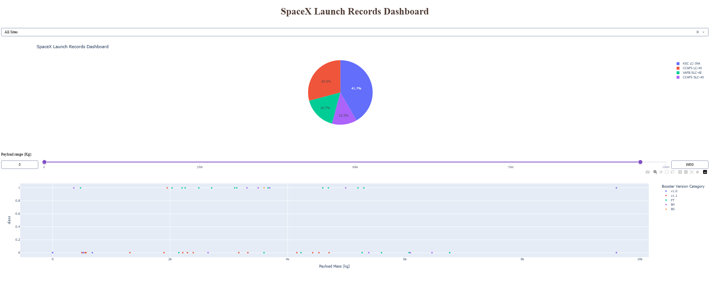
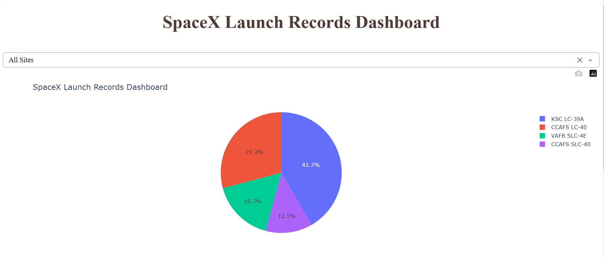
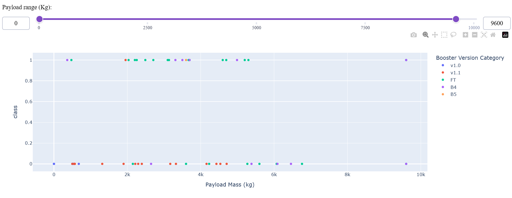

# IBM SpaceX Launch Analysis Capstone

This repository contains my final capstone project for the IBM Data Science Professional Certificate.

The project analyzes SpaceX Falcon 9 launch data using data science techniques such as data collection, web scraping, SQL analysis, data visualization, dashboard development, and machine learning prediction.

---

# Project Objectives

The main objectives of this project are:

- Collect SpaceX launch data from APIs and web sources
- Perform data wrangling and cleaning
- Analyze launch records using SQL
- Create interactive visual analytics
- Build dashboard visualizations
- Predict Falcon 9 first stage landing success using machine learning

---

# Project Workflow

## 1. Data Collection using API
Collected SpaceX launch data using SpaceX APIs.

Notebook:
- `jupyter-labs-spacex-data-collection-api.ipynb`

---

## 2. Web Scraping
Extracted launch-related information from web pages using web scraping techniques.

Notebook:
- `jupyter-labs-webscraping.ipynb`

---

## 3. Data Wrangling
Cleaned and prepared the dataset for analysis.

Notebook:
- `labs-jupyter-spacex-Data wrangling.ipynb`

---

## 4. SQL Exploratory Data Analysis
Performed SQL queries and exploratory data analysis to identify launch trends and insights.

Notebook:
- `jupyter-labs-eda-sql-coursera_sqllite.ipynb`

---

## 5. Interactive Visual Analytics with Folium
Created interactive maps and visual analytics using Folium.

Notebook:
- `Interactive_Visual_Analytics_With_Folium.ipynb`

---

## 6. Dashboard Visualizations
Developed visual dashboard outputs for launch analysis.

Images:
- `spacex_dashboard_full.png`
- `spacex_dashboard_piechart.png`
- `spacex_dashboard_scatterplot.png`

---

## 7. Machine Learning Prediction
Built machine learning models to predict Falcon 9 first stage landing success.

Notebook:
- `SpaceX_Machine Learning Prediction_Part_5.ipynb`

---

# Technologies Used

- Python
- Pandas
- NumPy
- SQL
- SQLite
- Folium
- Plotly Dash
- Matplotlib
- Seaborn
- Scikit-learn
- Jupyter Notebook

---

# Key Skills Demonstrated

- Data Collection
- Data Cleaning
- Exploratory Data Analysis
- SQL Querying
- Interactive Visualization
- Dashboard Development
- Machine Learning
- Predictive Analytics

---
# Dashboard Visualizations

## Full Dashboard

## Pie Chart Visualization

## Scatter Plot Visualization

# Author

Ruel Laranjo  
Aspiring Data Scientist | Computer Systems Engineering Graduate  
IBM Data Science Professional Certificate Candidate
